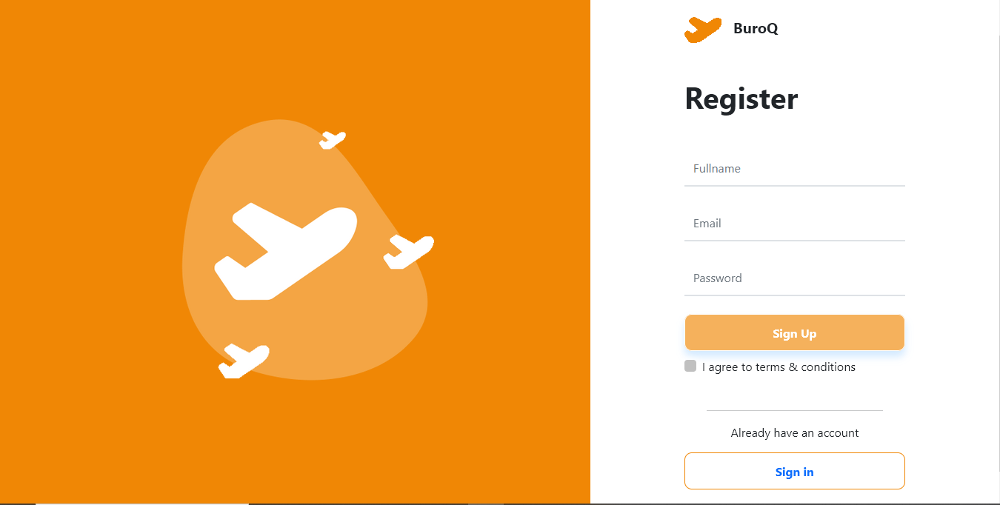
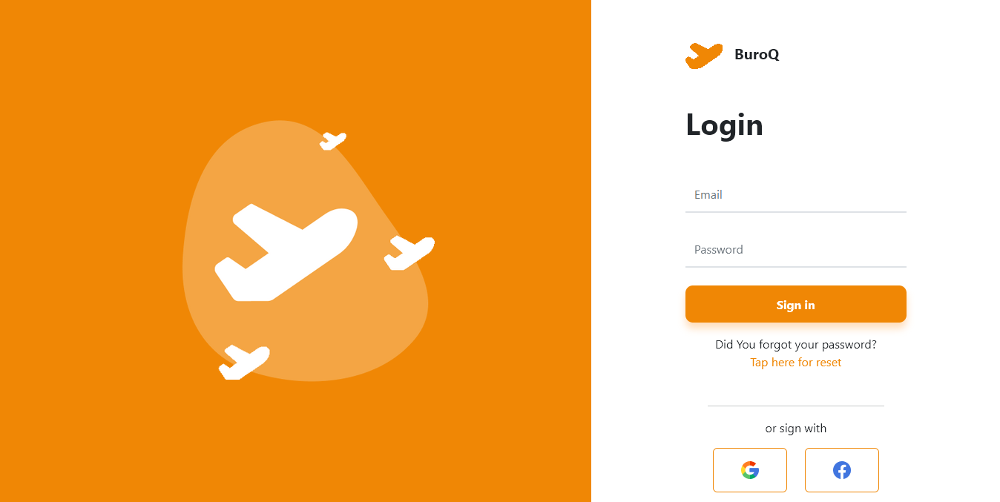
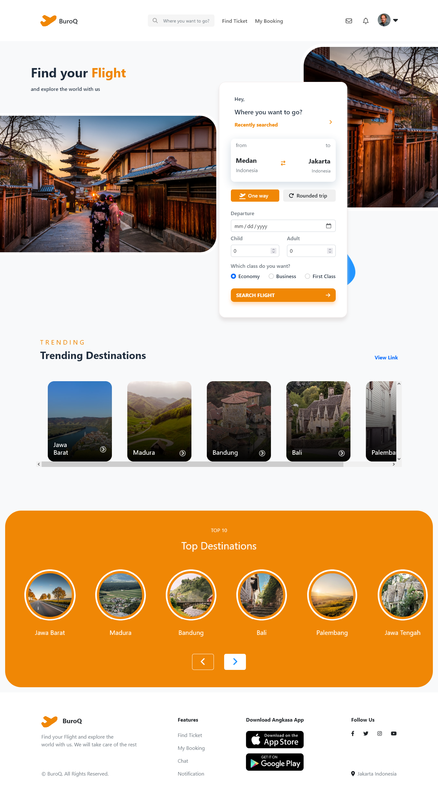
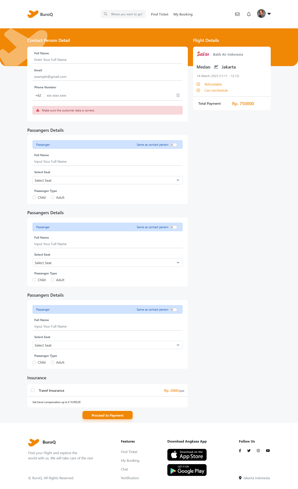
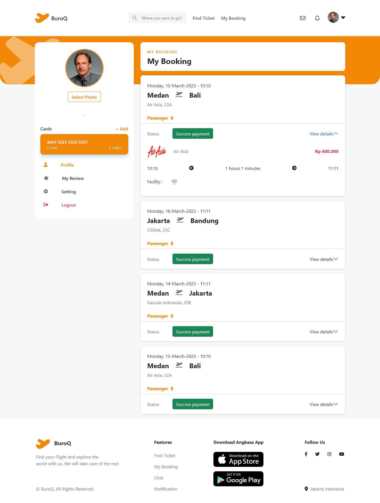
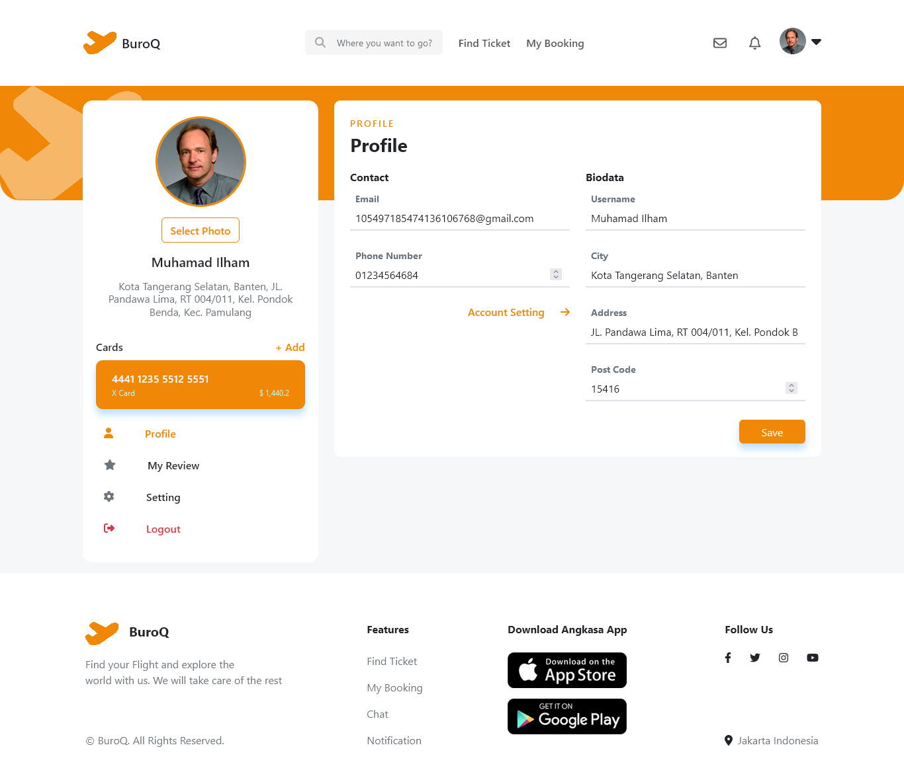
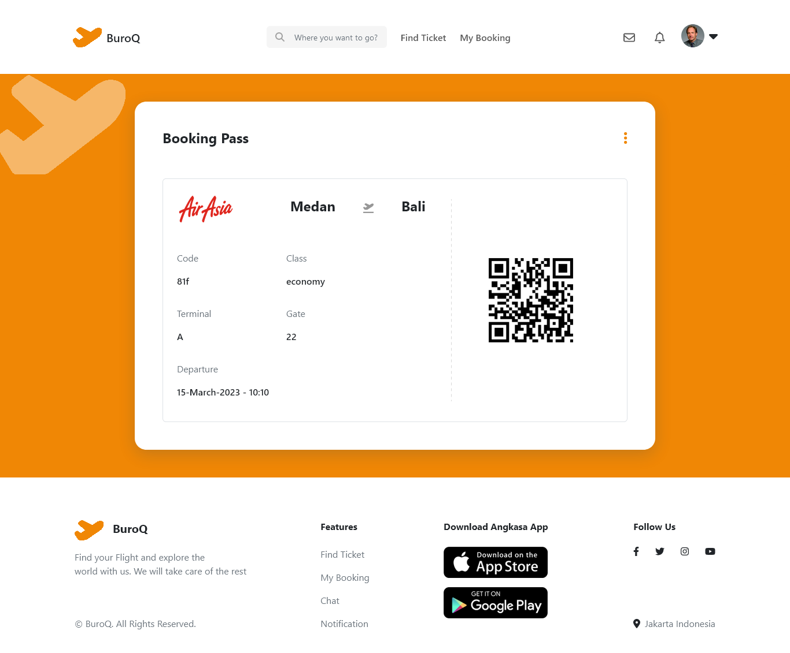
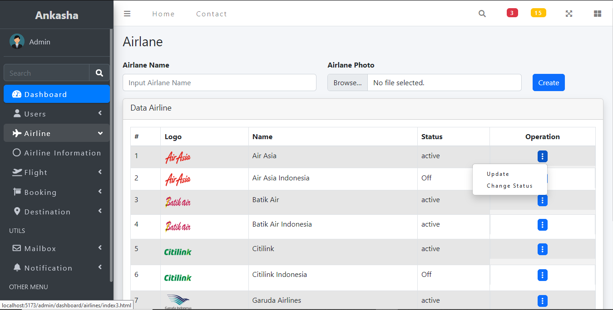
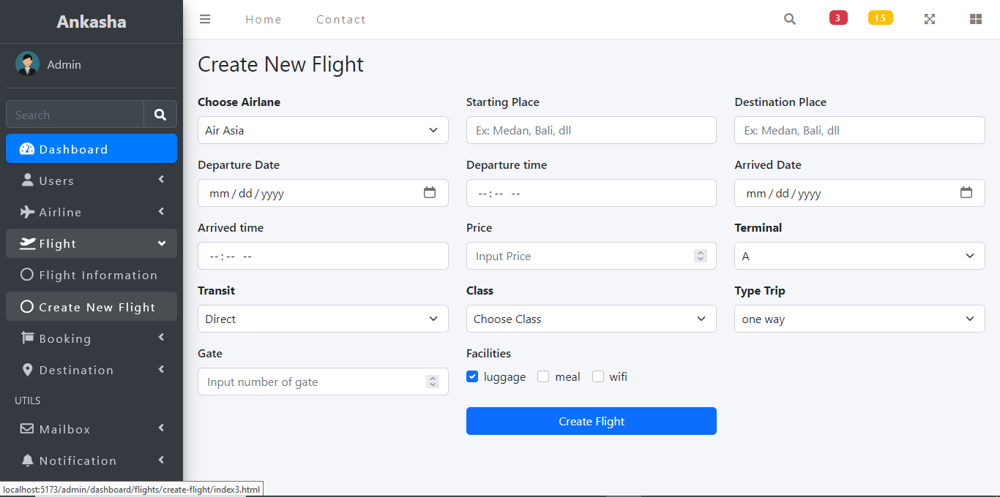
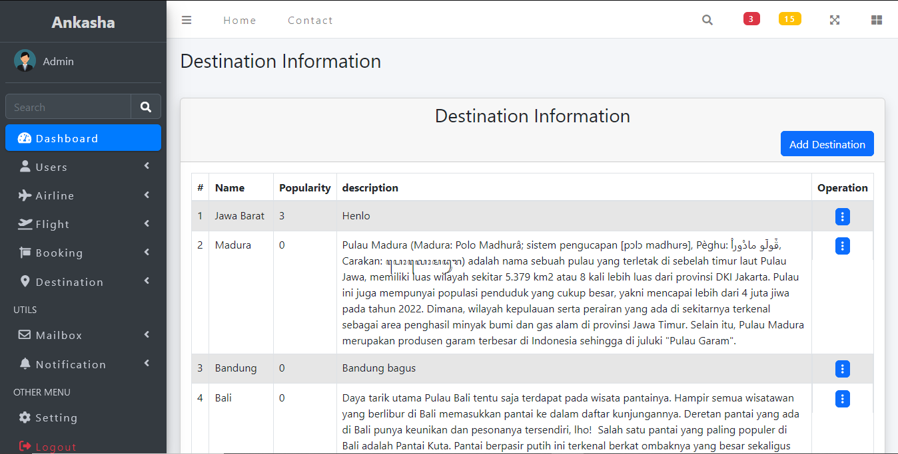

<p align="center">
<div align="center">
  
</div>
  <h3 align="center">BuroQ App</h3>
  <p align="center">
    <a href="https://github.com/mhmdiamd/ui-tiket-app"><strong>Explore the docs »</strong></a>
    <br />
    <a href="https://ui-tiket-app.vercel.app/">View Demo</a>
    ·
    <a href="https://be-tiket-app.up.railway.app/api/v1">Api Demo</a>
  </p>
</p>

<!-- TABLE OF CONTENTS -->

## Table of Contents

- [Table of Contents](#table-of-contents)
- [About The Project](#about-the-project)
  - [Built With](#built-with)
- [Getting Started](#getting-started)
  - [Prerequisites](#prerequisites)
  - [Installation](#installation)
  - [Setup .env](#setup-env)
- [Screenshots](#screenshots)
- [Contributing](#contributing)
- [Related Project](#related-project)
- [Contact](#contact)

<!-- ABOUT THE PROJECT -->

## About The Project

BuroQ is a website project that aims to provide a service for booking intercity or interregional flight tickets in Indonesia. The site offers various airline options and flight schedules that can be booked by users online.

One of the outstanding features of BuroQ is the ability to compare prices and flight schedules from different airlines in one display. This makes it easy for users to choose the best option according to their needs and budget.

To use this service, users only need to create an account and enter their travel details such as the city of origin, destination, date, and number of passengers. BuroQ will display a list of available flights, and users can choose the most suitable option for them.

<!-- GETTING STARTED -->

## Getting Started

### Prerequisites

This is an example of how to list things you need to use the software and how to install them.

- [nodejs](https://nodejs.org/en/download/)
- [Bootstrap Css](https://getbootstrap.com/)
- [Vite JS](https://vitejs.dev/)
- [Redux](https://redux.js.org/)

### Installation

- Clone This Front End Repo

```
git clone https://github.com/mhmdiamd/ui-tiket-app
```

- Go To Folder Repo

```
cd ui-tiket-app
```

- Install Module

```
npm install
```

- <a href="#setup-env">Setup .env</a>
- Type ` npm run dev` To Start Website
- Type ` npm run production` To Start Production

### Setup .env

Create .env file in your root project folder.

```
VITE_API_ENDPOINT = [BACKEND_URL]
```

<!-- ROADMAP -->

## Screenshots

<table>
 <tr>
    <td></td>
    <td> </td>
  </tr>
   <tr>
    <td>Register</td>
    <td>Login</td>
  </tr>

  <tr>
    <td> </td>
     <td></td>
  </tr>
   <tr>
    <td>Landing Page</td>
     <td>Flight Detail</td>
  </tr>
    <tr>
    <td> </td>
    <td></td>
  </tr>
   <tr>
    <td>My Booking</td>
     <td>Profile</td>
  </tr>
    <tr>
    <td> </td>
     <td></td>
  </tr>
   <tr>
    <td>Passanger Tiker</td>
     <td>Admin Login</td>
  </tr>
  <tr>
    <td> </td>
    <td></td>
  </tr>
    <tr>
      <td>Airline Information - Admin</td>
      <td>Create Flight - Admin</td>
    </tr>
  <tr>
    <td> </td>
    <td></td>
  </tr>
   <tr>
    <td>Airline Admin</td>
     <td>Flight Admin</td>
  </tr>
<!-- CONTRIBUTING -->

## Contributing

Contributions are what make the open source community such an amazing place to be learn, inspire, and create. Any contributions you make are **greatly appreciated**.

1. Fork the Project
2. Create your Feature Branch (`git checkout -b feature/AmazingFeature`)
3. Commit your Changes (`git commit -m 'Add some AmazingFeature'`)
4. Push to the Branch (`git push origin feature/AmazingFeature`)
5. Open a Pull Request

## Related Project

:rocket: [`Backend BuroQ`](https://github.com/ikkair/be-tiket-app)

:rocket: [`Frontend BuroQ`](https://github.com/mhmdiamd/ui-tiket-app)

:rocket: [`Demo BuroQ`](https://ui-tiket-app.vercel.app/)

<!-- Meet The Teams -->

## Meet The Teams

<center>
  <table align="center">
    <tr >
      <th >Fullstack Developer / Product Manager</th>
      <th >Frontend Developer</th>
      <th >Frontend Developer</th>
      <th >Backend Developer</th>
      <th >Backend Developer</th>
    </tr>
    <tr >
      <td align="center">
        <a href="https://github.com/mhmdiamd">
          <br/>
          <b>Muhamad Ilham Darmawan</b>
        </a>
      </td>
      <td align="center">
        <a href="https://github.com/Shaniara28">
          <br/>
          <b>Shania Rizky Agustin</b>
        </a>
      </td>
      <td align="center">
        <a href="https://github.com/Dhimasswara">
          <br/>
          <b>Dhimas Pandu Yogaswara</b>
        </a>
      </td>
      <td align="center">
        <a href="https://github.com/ikkair">
          <br/>
          <b>Ikhlasul Kamal Irmansyah</b>
        </a>
      </td>
      <td align="center">
        <a href="https://github.com/VerdyNordsten">
          <br/>
          <b>Verdy Prido Lughara</b>
        </a>
      </td>
    </tr>
  </table>
</center>

Project Link: [https://github.com/mhmdiamd/ui-tiket-app](https://github.com/mhmdiamd/ui-tiket-app)